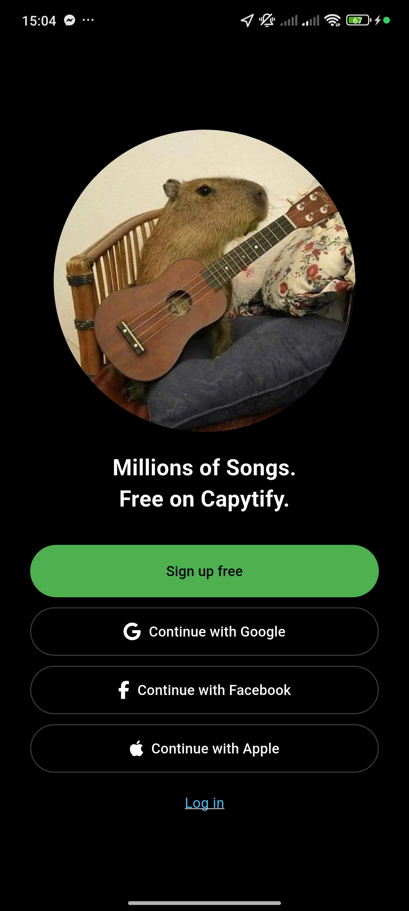
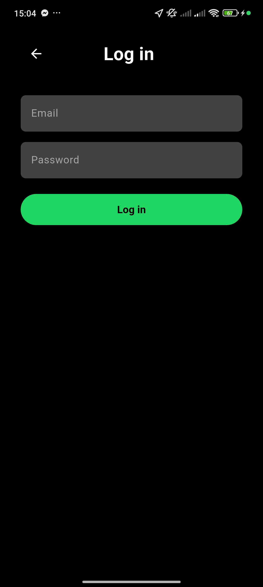
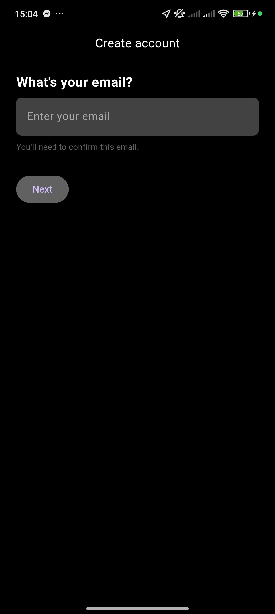
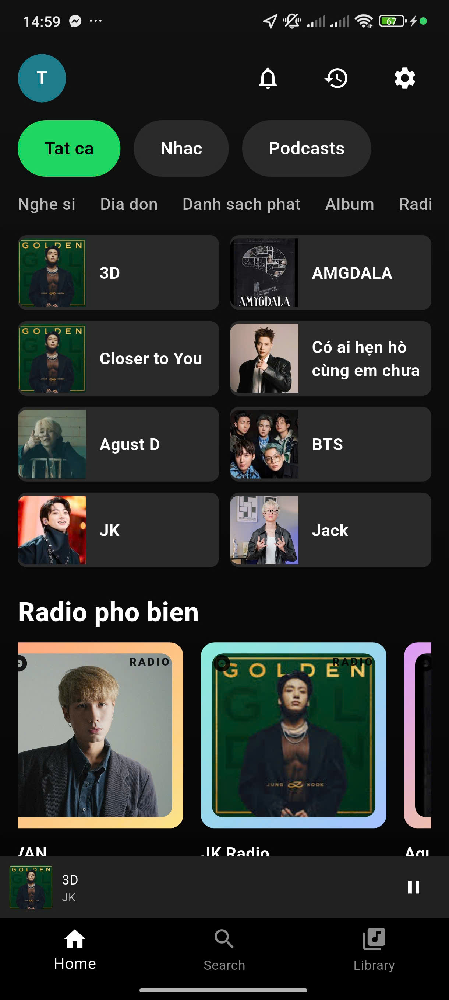
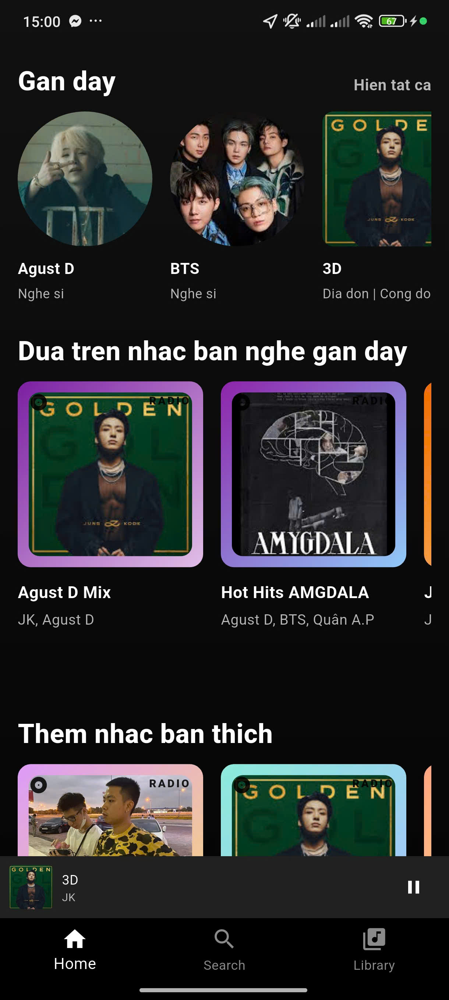
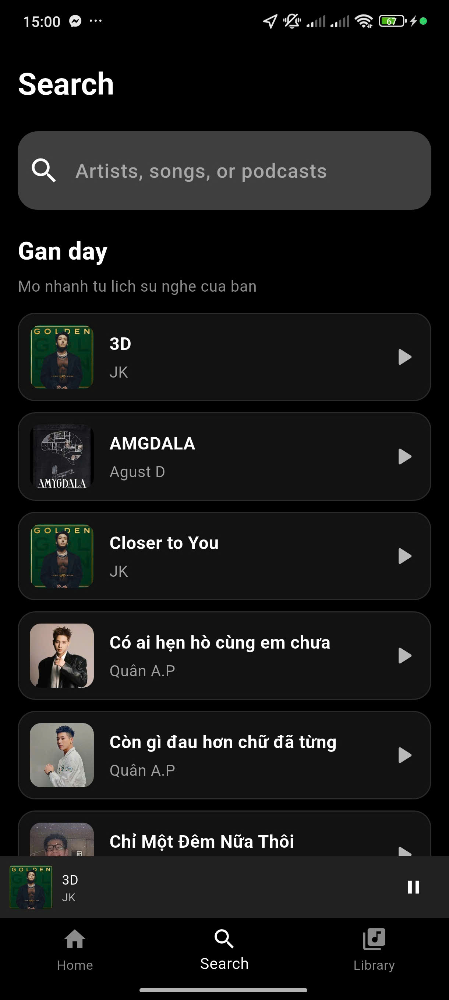
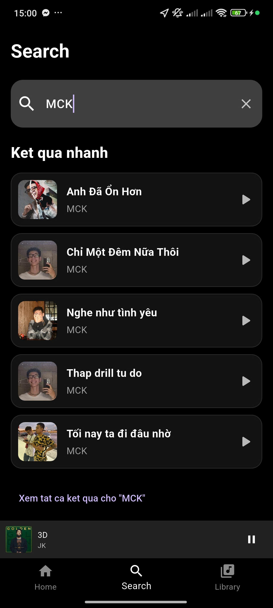
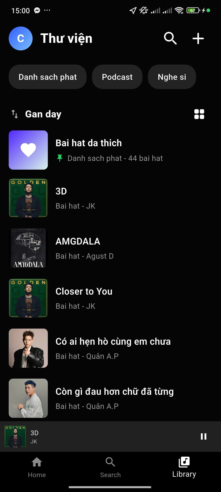
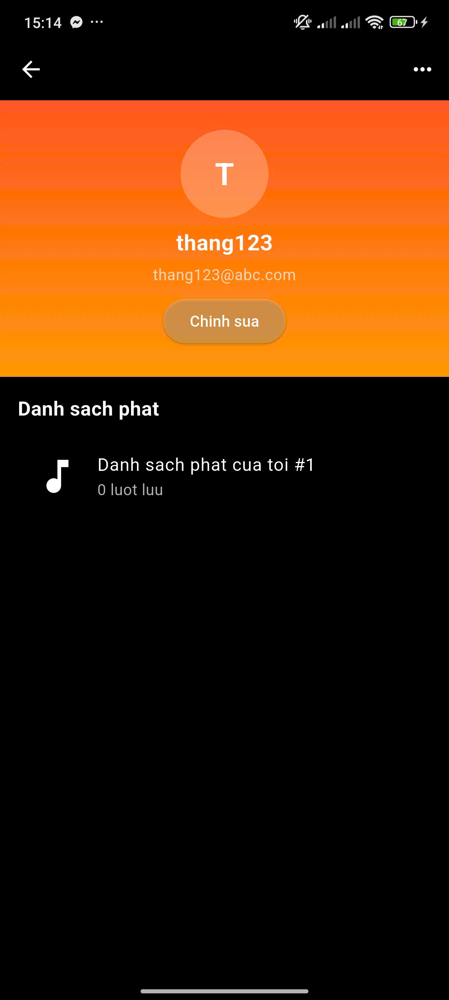
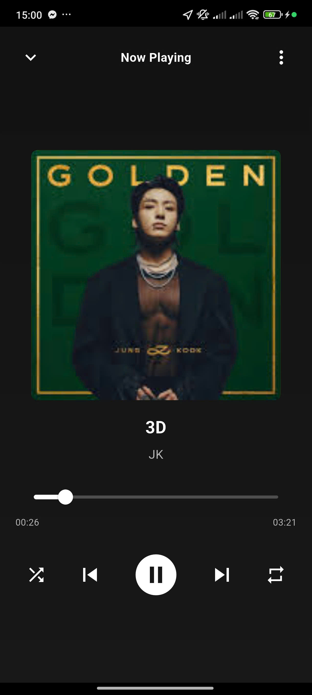

# Capitify

Capitify is a Flutter music app inspired by Spotify-style browsing and playback. The app uses Firebase Authentication for login, Cloud Firestore for music data, `just_audio` for playback, and `shared_preferences` for local caching of library and player state.

## Screenshots

### Authentication

<p align="center">
  
  
  
</p>

### Home

<p align="center">
  
  
</p>

### Search

<p align="center">
  
  
</p>

### Library And Profile

<p align="center">
  
  
</p>

### Player

<p align="center">
  
</p>

## Current Features

- Email/password authentication with Firebase Auth
- Home, Search, Library, Artist, and Now Playing screens
- Song and artist data loaded from Firestore
- Mini player with queue, next/previous, shuffle, and repeat
- Restore last player state after reopening the app
- Cache songs, artists, recently played items, and player state locally
- Cached network images for avatars and artwork

## Tech Stack

- Flutter
- Provider
- Firebase Core
- Firebase Auth
- Cloud Firestore
- just_audio
- shared_preferences
- cached_network_image

## Project Structure

```text
lib/
  features/
    auth/
    home/
    music/
  shared/
    widgets/
  main.dart
```

Main areas:

- `lib/features/auth`: login, signup, auth flow
- `lib/features/home`: home/search/library navigation and screens
- `lib/features/music`: models, Firestore services, player state, music screens
- `lib/shared/widgets`: shared UI components such as cached image widgets

## Getting Started

### 1. Install dependencies

```bash
flutter pub get
```

### 2. Configure Firebase

This project calls `Firebase.initializeApp()` in `lib/main.dart`, so Firebase must be configured for the target platform before running.

Required services:

- Firebase Authentication
- Cloud Firestore

You should add the platform Firebase config files generated from your Firebase project, for example:

- `android/app/google-services.json`
- `ios/Runner/GoogleService-Info.plist`

If you use FlutterFire CLI, you can also generate and wire the config from there.

### 3. Prepare Firestore data

The app currently reads from these collections:

- `songs`
- `artists`

Expected `songs` document fields:

- `title`
- `artist`
- `imageUrl`
- `audioUrl`

Expected `artists` document fields:

- `name`
- `imageUrl`

Notes:

- Songs without `audioUrl` are filtered out.
- Artist and song lists are sorted alphabetically in the app.

### 4. Run the app

```bash
flutter run
```

## Local Cache Behavior

The app stores local data using `shared_preferences` through `LocalCacheService`.

Cached items include:

- song library
- artist library
- recently played songs
- player state

This helps the app show existing data faster and restore playback state between launches.

## Important Files

- `lib/main.dart`: app bootstrap, providers, Firebase init
- `lib/features/music/data/services/music_library_service.dart`: Firestore reads for songs and artists
- `lib/features/music/data/services/local_cache_service.dart`: local persistence
- `lib/features/music/presentation/state/mini_player_provider.dart`: playback state, queue logic, player restore
- `lib/features/home/presentation/screens/search_screen.dart`: search UI and quick results
- `lib/features/home/presentation/screens/library_screen.dart`: library UI built from real app data

## Development Notes

- The project currently uses a dark theme via `ThemeData.dark()`.
- Search suggestions are built from the loaded song list.
- Library content is currently derived from songs and recently played items already available in the app.
- There is an older untracked `lib/views/...` path in the workspace that does not match the current `lib/features/...` structure and should not be treated as the main implementation.

## Recommended Cleanup

- Replace the default `description` in `pubspec.yaml`
- Document Firestore security rules
- Remove unused legacy files if they are no longer needed

## License

This project currently has no license file in the repository.
